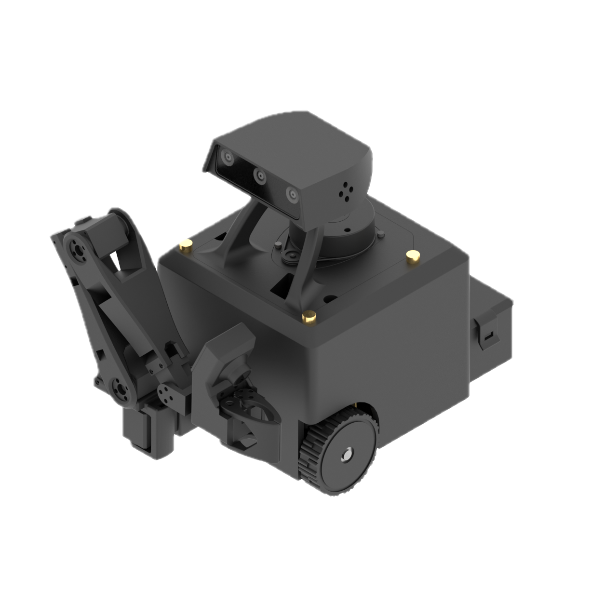

# Home

<figure><figcaption></figcaption></figure>

At Innate, we make **affordable & intuitive AI robots** that you can teach and program.

Our whole stack, from the hardware to the software, is designed to run the state-of-the-art of AI in embodied agents and manipulation models.

This documentation describes our robots, our open operating system, how to develop with it, and examples of what you can do with them.

Our systems are developed with a few principles in mind:

* Users should be able to quickly run programs developed for our robots.
* Developers should have access to a complete powerful stack.
* The robots should be robust, reliable and precise to execute AI algorithms.

***


{% column width="50%" %}
## Robots

<figure><figcaption></figcaption></figure>

MARS, Innate's first robot, is a portable mobile manipulator **under $2k** capable of running embodied agents and VLAs.

Perfect for developers & hobbyists looking to build on the state of the art of AI


[mars](robots/mars/)



{% column width="50%" %}
## Innate OS & BASIC

How to develop and train your robot running the Innate OS and its brain BASIC.

Run your first behavior in minutes, learn how to make complex behaviors with VLAs, and share your behaviors with others.


[Broken link](broken-reference)




<strong>Any question that this documentation cannot answer ?</strong>

