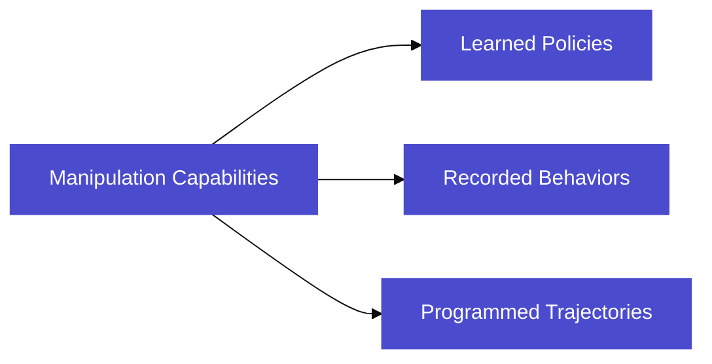

# Manipulation

## Overview

The manipulation system consists of a compact 5 degree-of-freedom (DOF) robotic arm designed for research and development in robotic manipulation. The system combines precise motor control, integrated vision capabilities, and a modular end-effector design to support a wide range of manipulation tasks.




Users can develop manipulation strategies through multiple approaches:

* Learning-based policies trained through teleoperation demonstrations
* Hardcoded motion sequences for repeatable tasks
* Recorded trajectories that can be played back for specific operations

The arm's integration with the innate SDK enables straightforward development of both learned and programmatic manipulation policies. Through the included leader arm interface, users can easily demonstrate desired behaviors, which can then be used to train learning-based policies or recorded for direct playback.

***

## Hardware

### Specifications

The robotic arm is a 5 degree-of-freedom (DOF) manipulator with a modular end effector. The arm's movement is powered by a combination of high-quality Dynamixel servo motors:

* 3 x Dynamixel XL430 motors
  * Typically used for major joints requiring higher torque
  * Enhanced positioning accuracy
  * Built-in PID control
* 3 x Dynamixel XL330 motors
  * Used for lighter-load movements and end effector
  * Optimized for speed and precision
  * Energy-efficient operation

### Vision System

* Integrated arm camera
  * 150-degree field of view
  * Provides visual feedback during teleoperation
  * Enables vision-based manipulation tasks

### Performance Characteristics

* Maximum reach: 10 inches
* Payload capacity: 200 grams at full extension
* Working envelope: Spherical segment defined by maximum reach

### Joint Configuration

The 5 DOF configuration provides:

* Base rotation
* Shoulder movement
* Elbow articulation
* Wrist pitch
* Wrist roll

### End Effector System

The arm features a modular end effector mount that supports:

* User-designed custom end effectors
* Swappable tool attachments
* Additional end effector designs (coming soon)

This modularity allows users to adapt the arm for various applications by designing and implementing their own end effector solutions. Future releases will include new end effector designs to expand the arm's capabilities.

***

## Teleoperation

### Leader Arm Setup

To teleoperate the robot using the included leader arm:

1. Prerequisites:
   * Ensure no other manipulation tasks are running
   * Use command: `innate manipulation pause`
   * Have access to a workstation with available USB-C port
2. Hardware Connection:
   * Connect leader arm to workstation via USB-C
   * Note: Leader arm can draw up to 1 Amp of current
   * Ensure stable power supply to workstation
3. Initialization:
   * Enter command: `innate manipulation teleop`
   * Wait for initialization (takes a few seconds)
   * System will initialize both leader and follower arms
4. Operation:
   * Follower arm will mirror leader arm's joint configuration
   * Camera feed window will automatically display
   * Real-time visual feedback provided through arm camera

***


## Recorded Behaviors

#### **Setup**

1. Connect leader arm to workstation via USB-C
2. Verify no other manipulation tasks are running using command line
3. Run initialization command:

```bash
innate manipulation train
```

#### **Task Configuration**

When prompted, provide the following information:

1. Task Type Selection
   * Enter 'r' for recorded policy
2. Task Name
   * Provide a descriptive name for the task
3. Task Description
   * Enter a concise description (1-2 sentences)
   * Include:
     * Objects to be manipulated
     * Task objectives
     * Key guidelines
   * Note: This description will be used when calling the task via the agent

#### **Recording Process**

Once teleoperation mode initializes, use the following controls:

* `Spacebar`: Multiple functions
  * Start recording the trajectory
  * Save recorded trajectory
* `X`: Cancel and delete recording
* `Escape`: Save and exit

#### **Storage Location**

* Recorded behaviors are stored in `~/behaviors` directory on the robot

**Note**: Unlike learned policies, recorded behaviors:

* Only require one successful demonstration of the desired trajectory
* Will replay the exact recorded trajectory when executed
* Provide no autonomous adaptation to environment changes

***


## Learned Policies

Maurice provides a streamlined process for developing learned manipulation policies through demonstration. Users can create new manipulation behaviors by demonstrating tasks via teleoperation, without requiring expertise in machine learning. The system handles the underlying complexities of policy training and deployment.


### Development Process

1. Data Collection
   * Demonstrate tasks using the leader arm teleoperation interface
   * Capture multiple demonstrations to provide task variations
   * System automatically logs relevant state and action data
   * No manual data formatting required
2. Data Upload
   * Upload demonstration data to Maurice console
   * System validates data integrity automatically
   * Access demonstration playback for verification
   * Organize demonstrations by task type
3. Policy Configuration
   * Select neural network architecture for the policy
   * Choose from available base models as starting points
   * Configure model structure and parameters
   * Adjust training parameters such as:
     * Learning rate
     * Epochs
   * Default configurations provided for common use cases
4. Training Execution
   * Initiate training through Maurice console
   * Monitor training status via progress dashboard
   * System automatically handles optimization process
   * Training typically takes 1-6 hours depending on task complexity
5. Deployment
   * Download trained policy files
   * Load policy onto Maurice system
   * Verify behavior matches demonstrations
   * Deploy to production environment

The process enables technical users to develop manipulation policies based on practical task knowledge while maintaining control over the underlying model architecture and training process.

### Data Collection Process

#### **Setup**

1. Connect leader arm to workstation via USB-C
2. Verify no other manipulation tasks are running using command line
3. Run initialization command:

```bash

innate manipulation train

```

#### **Task Configuration**

When prompted, provide the following information:

1. Task Type Selection
   * Enter 'l' for learned policy
   * Enter 'r' for recorded policy
2. Task Name
   * Provide a descriptive name for the task
3. Task Description
   * Enter a concise description (1-2 sentences)
   * Include:
     * Objects to be manipulated
     * Task objectives
     * Key guidelines
   * Note: This description will be used when calling the task via the agent

#### **Recording Demonstrations**

Once teleoperation mode initializes, use the following controls:

* `Spacebar`: Multiple functions
  * Start recording a new example
  * Save current example
* `X`: Cancel and delete current example
* `Escape`: Save all episodes and exit

#### **Data Collection Tips**

* Vary Task Settings
  * Change object positions between demonstrations
  * Vary robot's initial position
  * Modify environmental conditions when applicable
  * These variations help policy generalize to new situations
* Maintain Consistency
  * Use the same strategy across all demonstrations
  * Keep movement patterns similar
  * Maintain consistent grasp points
  * Uniform approach angles when possible
* Handle Failures
  * When a demonstration fails, continue to completion
  * Do not cancel failed attempts
  * Retry the task with the same configuration
  * Failed attempts provide valuable learning data

#### **Data Access**

* Recorded demonstrations are stored in `~/data` directory
* Access data via SSH connection to robot
* Data is automatically formatted for training

#### Data Management Commands

1. List All Tasks

```bash
innate data list
```

This command displays:

* Task names
* Data size
* Task specifics

1. View Task Details

```bash
innate data status task_name
```

This command shows:

* Task type (learned/recorded)
* Task description
* Number of episodes
* Data statistics:
  * Episode lengths
  * Other relevant metrics

#### Adding More Data

To add additional demonstrations to an existing task:

1. Run the training command again:

```bash

innate manipulation train

```

1. Enter the same task name as before
2. New demonstrations will be appended to existing data
3. Verify updated data status using `data status` command

### Data Upload

**Upload Command**

```bash
innate data upload task_name

```

**Requirements**

* Robot must remain powered on
* Stable internet connection required
* Upload time varies with internet speed (up to 45 minutes)

**Monitor Progress** Check upload status using:

```bash
innate data upload task_name -p

```

**Verification in Maurice Console**

1. Visit Maurice data console
2. Navigate to "Data Sets" section
3. Locate your uploaded task
4. Verify:
   * All episodes are present
   * Playback episodes to check upload quality

**Best Practices**

* Ensure stable power supply during upload
* Maintain consistent network connection
* Verify upload completion before powering down
* Monitor progress periodically for large datasets

### Policy Training

#### **Policy Configuration**

1. Navigate to "Policies" section in Maurice console
2. Click "Add New Policy"
3. Select architecture and base model
   * Currently supports ACT and Random Weights
   * More improved base models coming soon
4. Configure training parameters
   * Learning rate
   * Number of epochs
   * Default values work well for most tasks
5. Select training datasets in dataset tab
6. Click execute to begin training

#### **Training Execution**

Training runs in background and can be monitored via the policy console, where you can track key parameters like train and validation loss. Policy training typically takes between 1-6 hours depending on dataset size and number of epochs.

### Download Policy

**Download Command**

```bash
innate policy download task_name
```

**Storage Location**

* Model weights are stored in `~/policy` directory on the robot

**Policy Evaluation**

To test the downloaded policy, use:

```bash
innate policy run task_name -t num_seconds
```

This will run the policy for the specified number of seconds.

***

## Control Via SDK

**Setup**

```python
from innate import manipulation
manipulation.init()
```

**Joint Control**

```python
# Get current joint positions# Returns numpy array of length 6 representing joint angles
joint_pose = manipulation.get_joint_pose()

# Set joint positions# joint_pose: numpy array of length 6 containing joint angles
manipulation.set_joint_pose(joint_pose)

# Execute joint trajectory# joint_poses: list of numpy arrays, each of length 6# times: list of corresponding timestamps
manipulation.set_joint_trajectory(joint_poses, times)
```

**End Effector Control**

```python
# Get end effector pose# Returns manipulation.Pose object with position and quaternion
ee_pose = manipulation.get_ee_pose()

# Set end effector pose# ee_pose: manipulation.Pose object with:#   - position: [x, y, z]#   - quaternion: [x, y, z, w]
manipulation.set_ee_pose(ee_pose)

# Execute end effector trajectory# ee_poses: list of manipulation.Pose objects# times: list of corresponding timestamps
manipulation.set_ee_trajectory(ee_poses, times)
```

**Gripper Control**

```python
# Get current gripper pressure# Returns float value between 0 and 1
pressure = manipulation.get_gripper_pressure()

# Set gripper pressure# pressure: float value between 0 and 1
manipulation.set_gripper_pressure(pressure)
```

**Behavior and Policy Execution**

```python
# Run a recorded behavior
manipulation.run_behavior(task_name)

# Run a learned policy for specified duration# time: duration in seconds
manipulation.run_policy(task_name, time)

# Interrupt current execution
manipulation.interrupt()
```

**Example Usage**

```python
from innate import manipulation
import time
import numpy as np

# Initialize the SDK
manipulation.init()

# Example 1: Basic joint control
print("Moving to initial position...")
# Small joint angles for compact arm
initial_joints = np.array([0.0, -0.2, 0.3, 0.0, -0.2, 0.0])  # radians
manipulation.set_joint_pose(initial_joints)
time.sleep(2)  # Wait for movement

# Example 2: Gripper control
print("Testing gripper...")
manipulation.set_gripper_pressure(0.5)  # 50% pressure for delicate grip
time.sleep(1)
manipulation.set_gripper_pressure(0.0)  # Open gripper
time.sleep(1)

# Example 3: End effector trajectory
poses = []
times = []
# Create a small square motion (1cm movements)
base_pose = manipulation.get_ee_pose()  # Get current pose
for i in range(4):
    new_pose = base_pose
    if i == 0:
        new_pose.position[0] += 0.01  # Move 1cm in x
    elif i == 1:
        new_pose.position[2] -= 0.01  # Move 1cm down
    elif i == 2:
        new_pose.position[0] -= 0.01  # Move back in x
    elif i == 3:
        new_pose.position[2] += 0.01  # Move back up
    poses.append(new_pose)
    times.append(i * 1.0)  # 1 second per movement

print("Executing small square trajectory...")
manipulation.set_ee_trajectory(poses, times)

# Example 4: Run a learned policy
print("Running pick and place policy...")
manipulation.run_policy("pick_and_place", 5)  # Run for 5 seconds

# Example 5: Run a recorded behavior
print("Running wave behavior...")
manipulation.run_behavior("wave_hello")
```

***

## Control Via Command Line

**Get joint positions**

```bash
innate manipulation get-joint-pose
# Returns: Six space-separated values representing joint angles in radians
```

**Set joint positions**

```bash
innate manipulation set-joint-pose j1 j2 j3 j4 j5 j6
# Input: 6 space-separated float values representing joint angles in radians
```

**Get end effector pose**

```bash
innate manipulation get-ee-pose
# Returns: Seven space-separated values (position x y z and quaternion x y z w)
```

**Set end effector pose**

```bash
innate manipulation set-ee-pose x y z qx qy qz qw
# Input:#   - Position: 3 space-separated floats (x y z)#   - Quaternion: 4 space-separated floats (qx qy qz qw)
```

**Get gripper pressure**

```bash
innate manipulation get-gripper-pressure
# Returns: Float value between 0 and 1
```

**Set gripper pressure**

```bash
innate manipulation set-gripper-pressure pressure
# Input: Float value between 0 and 1
```

**Run behavior**

```bash
innate manipulation run-behavior task_name
# Input: String name of the recorded behavior
```

**Run policy**

```bash
innate manipulation run-policy task_name -t time
# Input:#   - task_name: String name of the policy#   - time: Integer number of seconds to run
```

**Interrupt execution**

```bash
innate manipulation interrupt
```

**Example Usage**

```bash
#!/bin/bash

echo "Testing various manipulation commands..."

# Get current joint positions
echo "Current joint positions:"
innate manipulation get-joint-pose

# Move to a specific joint configuration (small angles)
echo "Moving to new position..."
innate manipulation set-joint-pose 0.0 -0.2 0.3 0.0 -0.2 0.0
sleep 2

# Get end effector pose
echo "Current end effector pose:"
innate manipulation get-ee-pose

# Move end effector to new pose (small movements)
echo "Moving end effector..."
# Moving to position slightly forward and up (1cm increments)
innate manipulation set-ee-pose 0.01 0.0 0.01 0.0 0.0 0.0 1.0
sleep 2

# Test gripper
echo "Testing gripper..."
innate manipulation set-gripper-pressure 0.5
sleep 1
innate manipulation set-gripper-pressure 0.0
sleep 1

# Run a recorded behavior
echo "Running wave behavior..."
innate manipulation run-behavior wave_hello
sleep 3

# Run a policy for 5 seconds
echo "Running pick and place policy..."
innate manipulation run-policy pick_and_place -t 5

echo "Done!"
```
