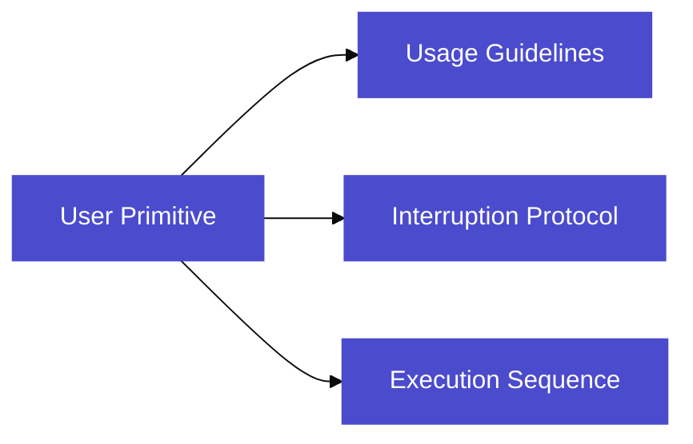

# User Primitives

## Overview

User Primitives are powerful building blocks that enable developers to create complex robot behaviors by combining Maurice's physical capabilities (navigation, manipulation) with digital functions (API calls, data processing, etc.). These primitives serve as the highest level of abstraction in Maurice's architecture, allowing the robot agent to seamlessly integrate physical and digital tasks into cohesive operations.




Each primitive consists of three essential components:

1. **Usage Guidelines**
   * Natural language descriptions of when the primitive should be used
   * Required environmental conditions and context
   * Constraints on when the primitive can be safely executed
   * Expected outcomes and side effects
   * Any dependencies on other primitives or system states
2. **Interruption Protocol**
   * Defined safety procedures for stopping execution
   * Cleanup steps to maintain system consistency
   * State restoration procedures
   * Error handling and recovery methods
   * Conditions under which interruption is allowed or blocked
3. **Execution Sequence**
   * Ordered list of physical and digital operations
   * Clear entry and exit conditions for each step
   * Error handling at each stage
   * Success/failure criteria with feedback
   * State validation between steps

## Defining Primitives

***

To create a new primitive, create a Python file in the `~/primitives` directory. Here's the basic structure:

```python
from innate.primitive import Primitive
from typing import Tuple

class MyPrimitive(Primitive):
    def __init__(self):
        """
        Initialize the primitive
        """
        super().__init__()# Required: initialize parent class

    def guidelines(self) -> str:
        """
        Define usage guidelines for when this primitive should be used
        Returns: string describing use cases and restrictions
        """
        return """
        Use this primitive when:
        - [Describe when to use this primitive]
        - [List relevant conditions]

        Do not use when:
        - [Describe when not to use this primitive]
        - [List restrictions or limitations]
        """

    def execute(self) -> Tuple[str, bool]:
        """
        Main execution logic
        Returns: (feedback string, success boolean)
        """
        try:
# Implement your primitive's logic here
            return "Task completed successfully", True
        except:
            return "Task failed", False

    def interrupt(self):
        """
        Define how to safely stop execution
        """
# Implement safe stopping behavior here

```

## Example Primitives

### 1. GoHome Primitive

File Location: `~/primitives/go_home.py`

A basic movement primitive that returns the robot to its home position. Demonstrates coordination between navigation and manipulation systems for safe repositioning.

Key Implementation Points:

* Initializes both navigation and manipulation systems
* Moves arm to zero position before navigation
* Uses absolute coordinates (0,0,0) for consistent home position

```python

from innate.primitive import Primitive
from innate import navigation, manipulation
import numpy as np
from typing import Tuple

class GoHome(Primitive):
    def __init__(self):
        super().__init__()
        navigation.init()
        manipulation.init()

    def guidelines(self) -> str:
        return """
        Use this primitive when:
        - Robot needs to return to its home position
        - Robot needs to reset its configuration
        - Starting a new set of tasks

        Do not use when:
        - Robot is carrying objects
        - Path to home is blocked
        """

    def execute(self) -> Tuple[str, bool]:
        try:
# First move arm to safe position
            home_joints = np.zeros(6)# All joints to zero position
            manipulation.set_joint_pose(home_joints)

# Then navigate to home position
            navigation.go_to_pose(0, 0, 0)

            return "Successfully returned to home position", True
        except Exception as e:
            return f"Failed to return home: {str(e)}", False

    def interrupt(self):
# Stop all movement
        navigation.interrupt()
        manipulation.interrupt()

```

### 2. Pick Trash Primitive

File Location: `~/primitives/pick_trash.py`

A vision-based manipulation primitive that uses natural language descriptions to identify and pick up trash items. Combines visual navigation with manipulation policies.

Key Implementation Points:

* Uses in-sight navigation with description matching
* Maintains safe distance (0.5m) during approach
* Executes pre-trained picking policy
* Includes safe gripper release in interruption

```python

from innate.primitive import Primitive
from innate import navigation, manipulation
import time
from typing import Tuple

class PickTrash(Primitive):
    def __init__(self):
        super().__init__()
# Initialize both systems
        navigation.init()
        manipulation.init()

    def guidelines(self) -> str:
        return """
        Use this primitive when:
        - You need to pick up trash or debris
        - The trash item is visible to the robot
        - The item is within the robot's manipulation range

        Do not use when:
        - The trash is too heavy (>200g)
        - The trash is hazardous material
        - Multiple items need to be picked at once
        - The item is not clearly visible
        """

    def execute(self, description: str) -> Tuple[str, bool]:
        try:
# Navigate to be near the described trash
            navigation.go_to_in_sight(description, distance=0.2)

# Move arm and wait
            manipulation.set_ee_pose({"x": 0.3, "y": 0.0, "z": 0.1})
            time.sleep(1)

# Run the grasping policy
            manipulation.run_policy("pick_item")

            return f"Successfully picked up {description}", True
        except Exception as e:
            return f"Failed to pick up {description}: {str(e)}", False

    def interrupt(self):
# Stop all movement
        navigation.interrupt()
        manipulation.interrupt()

# Release gripper if engaged
        manipulation.set_gripper_pressure(0.0)

```

### 3. Alert User Primitive

File Location: `~/primitives/alert_user.py`

A digital integration primitive that combines physical gestures with email notifications for security alerts. Shows basic integration of robot actions with external services.

Key Implementation Points:

* Coordinates physical gesture with email sending
* Uses SMTP for reliable email delivery
* Includes safe arm positioning in interruption
* Provides detailed alert messages with descriptions

```python

from innate.primitive import Primitive
from innate import manipulation
import smtplib
from email.message import EmailMessage
import time
from typing import Tuple

class AlertUser(Primitive):
    def __init__(self):
        super().__init__()
        manipulation.init()
# Email configuration
        self.smtp_server = "smtp.gmail.com"
        self.smtp_port = 587
        self.sender_email = "robot@innate.bot"
        self.sender_password = "your-app-password"# Use app-specific password

    def guidelines(self) -> str:
        return """
        Use this primitive when:
        - Suspicious activity is detected
        - Unauthorized person is present
        - Unusual behavior is observed
        - Security concerns arise

        Do not use when:
        - Regular employees are present
        - Scheduled maintenance is occurring
        - Known visitors are in the space
        """

    def execute(self, description: str) -> Tuple[str, bool]:
        try:
# Raise hand high
            manipulation.set_ee_pose({"x": 0.0, "y": 0.0, "z": 0.5})
            time.sleep(1)

# Send email alert
            msg = EmailMessage()
            msg.set_content(f"Suspicious activity detected: {description}")
            msg['Subject'] = 'Security Alert: Suspicious Activity'
            msg['From'] = self.sender_email
            msg['To'] = "user@innate.bot"

            with smtplib.SMTP(self.smtp_server, self.smtp_port) as server:
                server.starttls()
                server.login(self.sender_email, self.sender_password)
                server.send_message(msg)

            return f"Alert sent for: {description}", True
        except Exception as e:
            return f"Failed to send alert: {str(e)}", False

    def interrupt(self):
        manipulation.interrupt()
        manipulation.set_ee_pose({"x": 0.0, "y": 0.0, "z": 0.0})

```

### 4. Gas Sensor Integration Primitive

File: `~/primitives/monitor_air.py`

A sensor integration primitive that combines gas sensing with robot navigation to monitor air quality in different locations. Shows hardware sensor integration with robot behaviors.

```python

from innate.primitive import Primitive
from innate import navigation
import board
import adafruit_sgp30
import smtplib
from email.message import EmailMessage
from typing import Tuple

class MonitorAir(Primitive):
    def __init__(self):
        super().__init__()
        navigation.init()
# Initialize sensor
        i2c = board.I2C()
        self.gas_sensor = adafruit_sgp30.Adafruit_SGP30(i2c)
# Thresholds
        self.thresholds = {
            'eco2': 1000,# ppm
            'tvoc': 250# ppb
        }
# Email setup
        self.smtp_server = "smtp.gmail.com"
        self.smtp_port = 587
        self.sender_email = "robot@innate.bot"
        self.sender_password = "your-app-password"

    def guidelines(self) -> str:
        return """
        Use this primitive when:
        - Air quality checks are needed
        - Monitoring enclosed spaces
        - Regular safety checks

        Do not use when:
        - Known hazardous conditions exist
        - Sensor needs calibration
        """

    def execute(self, location: str) -> Tuple[str, bool]:
        try:
# Navigate to location
            navigation.go_to_in_sight(location, distance=1.0)

# Get readings
            readings = {
                'eco2': self.gas_sensor.eCO2,
                'tvoc': self.gas_sensor.TVOC
            }

# Check thresholds
            if (readings['eco2'] > self.thresholds['eco2'] or
                readings['tvoc'] > self.thresholds['tvoc']):
# Send alert
                msg = EmailMessage()
                msg.set_content(
                    f"High gas levels at {location}\n"
                    f"eCO2: {readings['eco2']} ppm\n"
                    f"TVOC: {readings['tvoc']} ppb"
                )
                msg['Subject'] = 'Air Quality Alert'
                msg['From'] = self.sender_email
                msg['To'] = "user@innate.bot"

                with smtplib.SMTP(self.smtp_server, self.smtp_port) as server:
                    server.starttls()
                    server.login(self.sender_email, self.sender_password)
                    server.send_message(msg)

                return "High gas levels detected - alert sent", False

            return "Air quality normal", True

        except Exception as e:
            return f"Monitoring failed: {str(e)}", False

    def interrupt(self):
        navigation.interrupt()

```

Key Implementation Points:

* Integrates SGP30 sensor readings with navigation
* Implements professional air quality thresholds
* Sends alerts when thresholds are exceeded
* Includes proper sensor initialization and timing
