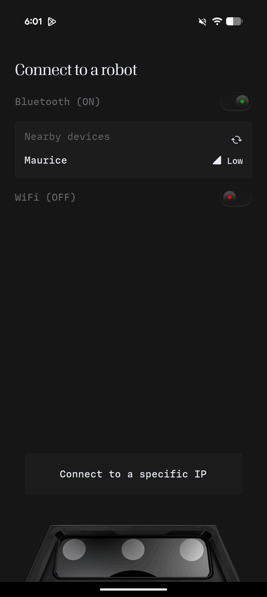
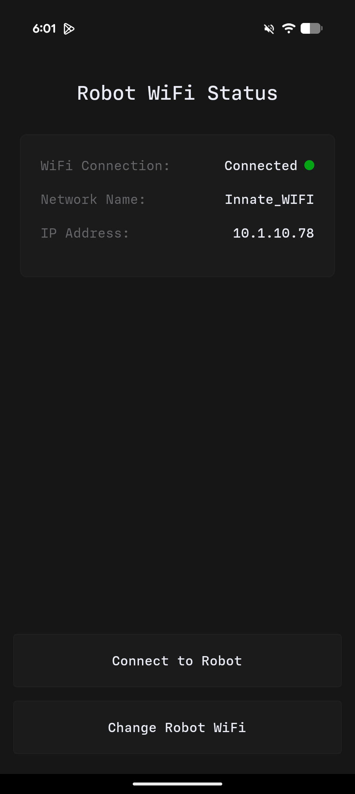
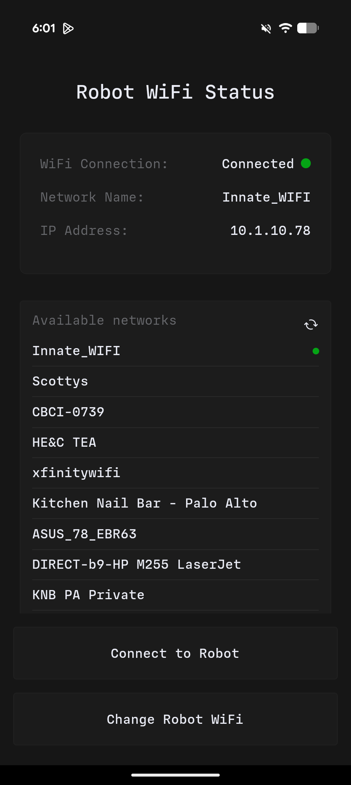

# Connecting to a robot

The Innate App connects to your robot via WiFi. It can also work with your phone hotspot.

## First-Time Connection

If this is the first time you are connecting, the app will guide you through an onboarding flow:

1. **Bluetooth Pairing** — The app uses Bluetooth Low Energy (BLE) to discover your robot and configure its network settings
2. **WiFi Configuration** — Tell the robot which network to connect to
3. **Connection** — Once on the same network, the app connects to the robot via WiFi

The robot publishes its hostname with a `.local` suffix (e.g., `mars-robot.local`), making it easy to connect even if the IP address changes.


{% column width="33.33333333333333%" %}
<figure><figcaption>
Press on the robot when it appears to connect via bluetooth
</figcaption></figure>



{% column width="33.33333333333333%" %}
<figure><figcaption>
If it's already on the same network than your phone, you can connect
</figcaption></figure>


{% column width="33.33333333333333%" %}
<figure><figcaption>
Otherwise, select "Change Robot WiFi" to pick another network to connect it to
</figcaption></figure>



Once connected, you can also get your current IP on the network in the Configuration Tab -> WiFi
