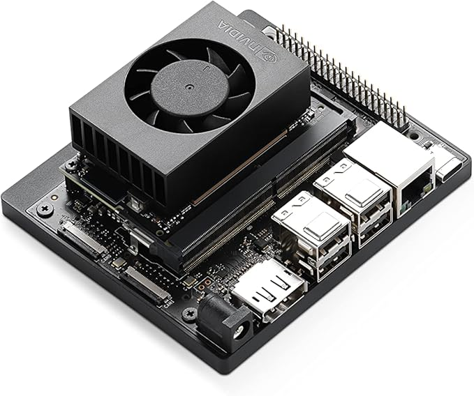

# Onboard computer

MARS comes with a [Jetson Orin Nano Super 8GB Development Kit.](https://www.nvidia.com/en-us/autonomous-machines/embedded-systems/jetson-orin/nano-super-developer-kit/)

<figure><figcaption></figcaption></figure>

Specs:

* **AI Performance:** Up to 67 TOPS (sparse INT8)
* **GPU:** NVIDIA Ampere architecture with 1024 CUDA cores and 32 Tensor cores
* **CPU:** 6-core ARM Cortex-A78AE v8 (64-bit)
* **Memory:** 8 GB LPDDR5&#x20;
* **Storage:** 1TB SSD (integrated by Innate) + 32GB microSD (for OS)
* **Developer Kit Includes:** Jetson Orin Nano Super module and reference carrier board

We include an additional 2 USB ports for users after everything is plugged in by Innate.

