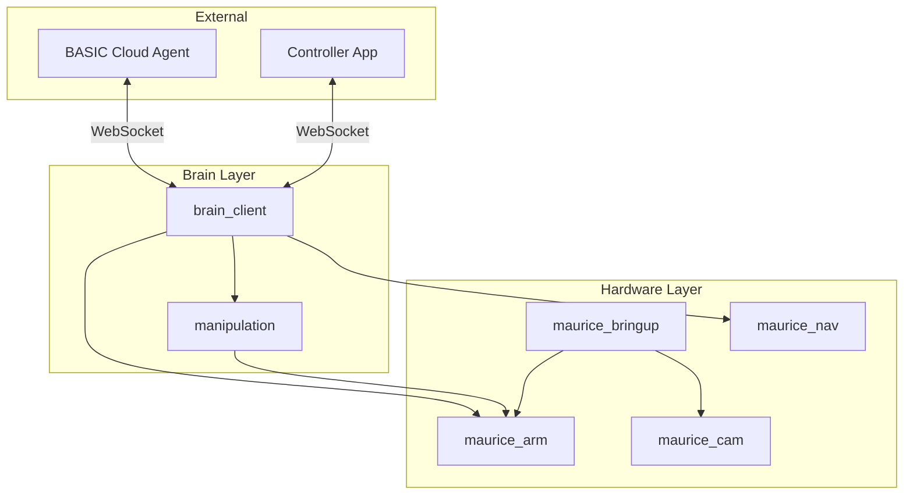

# ROS2 Reference

This page provides a complete reference of ROS2 topics, services, and actions available on MARS. Use this when you need to interact directly with the robot's ROS2 layer.


These interfaces may change between firmware versions. If something doesn't work as documented, check you're on the latest firmware or ask on [Discord](https://discord.com/invite/KtkyT97kc7).


---

## Topics

### Mobility

| Topic | Type | Description |
|-------|------|-------------|
| `/cmd_vel` | `geometry_msgs/Twist` | Velocity commands (linear.x, angular.z) to drive the robot |
| `/odom` | `nav_msgs/Odometry` | Robot odometry (position, orientation, velocity) |

### Cameras

| Topic | Type | Description |
|-------|------|-------------|
| `/mars/main_camera/image` | `sensor_msgs/Image` | Main RGB camera (front-facing OAK-D) |
| `/mars/arm/image_raw` | `sensor_msgs/Image` | Gripper camera (wrist-mounted) |
| `/oak/rgb/image_raw` | `sensor_msgs/Image` | Alternative topic for main camera |

### Arm

| Topic | Type | Description |
|-------|------|-------------|
| `/mars/arm/state` | `sensor_msgs/JointState` | Current arm joint positions |
| `/mars/arm/commands` | `std_msgs/Float64MultiArray` | Direct arm joint position commands |
| `/leader/state` | `sensor_msgs/JointState` | Leader arm joint positions (when connected) |
| `/joint_states` | `sensor_msgs/JointState` | Combined joint states for visualization |

### System

| Topic | Type | Description |
|-------|------|-------------|
| `/battery_state` | `sensor_msgs/BatteryState` | Battery level and charging status |
| `/scan` | `sensor_msgs/LaserScan` | LiDAR scan data (RPLidar) |

### Brain

| Topic | Type | Description |
|-------|------|-------------|
| `/ws_messages` | `std_msgs/String` | Incoming WebSocket messages from cloud agent |
| `/ws_outgoing` | `std_msgs/String` | Outgoing WebSocket messages to cloud agent |

---

## Services

### Arm Control

| Service | Type | Description |
|---------|------|-------------|
| `/mars/arm/goto_js` | `maurice_msgs/GotoJS` | Move arm to joint positions over specified time |
| `/mars/head/set_ai_position` | `std_srvs/Trigger` | Move head to default AI viewing position |

**GotoJS Request:**
```
std_msgs/Float64MultiArray data  # Target joint positions
int32 time                        # Duration in milliseconds
---
bool success
```

### System

| Service | Type | Description |
|---------|------|-------------|
| `/light_command` | `maurice_msgs/LightCommand` | Control robot LED lights |
| `/shutdown` | `maurice_msgs/Shutdown` | Trigger system shutdown |
| `/set_robot_name` | `maurice_msgs/SetRobotName` | Set robot display name |
| `/trigger_update` | `maurice_msgs/TriggerUpdate` | Trigger firmware update |

**LightCommand Request:**
```
uint8 mode       # 0=Off, 1=Solid, 2=Blink, 3=Ring
uint16 interval  # Animation interval in ms (1-10000)
uint8 r          # Red (0-255)
uint8 g          # Green (0-255)
uint8 b          # Blue (0-255)
---
bool success
string message
```

### Navigation

| Service | Type | Description |
|---------|------|-------------|
| `/grid_localize` | `maurice_msgs/GridLocalize` | Estimate robot pose on map using laser scan |
| `/change_map` | `brain_messages/ChangeMap` | Switch to a different saved map |
| `/save_map` | `brain_messages/SaveMap` | Save the current map |
| `/delete_map` | `brain_messages/DeleteMap` | Delete a saved map |
| `/change_navigation_mode` | `brain_messages/ChangeNavigationMode` | Switch navigation mode |

### Brain System

| Service | Type | Description |
|---------|------|-------------|
| `/get_available_primitives` | `brain_messages/GetAvailablePrimitives` | List all available skills |
| `/get_available_directives` | `brain_messages/GetAvailableDirectives` | List all available agents |
| `/get_available_behaviors` | `brain_messages/GetAvailableBehaviors` | List manipulation behaviors |
| `/reset_brain` | `brain_messages/ResetBrain` | Reset the brain system |
| `/set_directive_on_startup` | `brain_messages/SetDirectiveOnStartup` | Set which agent loads on boot |
| `/get_chat_history` | `brain_messages/GetChatHistory` | Get conversation history |

### Data Recording

| Service | Type | Description |
|---------|------|-------------|
| `/new_task` | `brain_messages/ManipulationTask` | Start recording a new manipulation task |
| `/new_episode` | `std_srvs/Trigger` | Start a new episode in current task |
| `/save_episode` | `std_srvs/Trigger` | Save current episode |
| `/cancel_episode` | `std_srvs/Trigger` | Discard current episode |
| `/end_task` | `std_srvs/Trigger` | Finish recording task |
| `/get_task_metadata` | `brain_messages/GetTaskMetadata` | Get task info |
| `/get_dataset_info` | `brain_messages/GetDatasetInfo` | Get dataset statistics |

---

## Actions

Actions are long-running tasks with progress feedback. Use these for navigation and manipulation.

### Manipulation

| Action | Type | Description |
|--------|------|-------------|
| `/execute_behavior` | `brain_messages/ExecuteBehavior` | Execute a learned manipulation behavior |
| `/execute_policy` | `brain_messages/ExecutePolicy` | Execute a policy for a set duration |
| `/execute_primitive` | `brain_messages/ExecutePrimitive` | Execute a skill/primitive |

**ExecuteBehavior:**
```
# Goal
string behavior_name
string behavior_config  # JSON config from metadata.json
---
# Result
bool success
string message
---
# Feedback
float64 elapsed_time
float64 remaining_time
string status
```

**ExecutePrimitive:**
```
# Goal
string primitive_type   # Skill name
string inputs           # JSON-encoded inputs
---
# Result
bool success
string message
string primitive_type
string success_type     # "success", "cancelled", or "failure"
---
# Feedback
string primitive_type
string feedback
```

### Navigation

Navigation uses the standard Nav2 action interfaces:

| Action | Type | Description |
|--------|------|-------------|
| `/navigate_to_pose` | `nav2_msgs/NavigateToPose` | Navigate to a specific pose |
| `/follow_waypoints` | `nav2_msgs/FollowWaypoints` | Follow a sequence of waypoints |

---

## Quick Examples

### Read battery level (Python)
```python
import rclpy
from rclpy.node import Node
from sensor_msgs.msg import BatteryState

class BatteryReader(Node):
    def __init__(self):
        super().__init__('battery_reader')
        self.sub = self.create_subscription(
            BatteryState, '/battery_state', self.callback, 10)

    def callback(self, msg):
        print(f"Battery: {msg.percentage * 100:.1f}%")

rclpy.init()
node = BatteryReader()
rclpy.spin(node)
```

### Set LED color (command line)
```bash
ros2 service call /light_command maurice_msgs/srv/LightCommand \
  "{mode: 1, interval: 0, r: 255, g: 0, b: 0}"
```

### Move the arm (Python)
```python
from maurice_msgs.srv import GotoJS
from std_msgs.msg import Float64MultiArray

# Create client
client = node.create_client(GotoJS, '/mars/arm/goto_js')

# Build request
request = GotoJS.Request()
request.data = Float64MultiArray()
request.data.data = [0.0, -1.0, 1.5, 0.0, 0.5, 0.0]  # 6 joint positions
request.time = 2000  # 2 seconds

# Call service
future = client.call_async(request)
```

### Drive forward (command line)
```bash
ros2 topic pub /cmd_vel geometry_msgs/msg/Twist \
  "{linear: {x: 0.2}, angular: {z: 0.0}}" --rate 10
```

---

## Useful Commands

```bash
# List all active topics
ros2 topic list

# Echo a topic
ros2 topic echo /battery_state

# List all services
ros2 service list

# Call a service
ros2 service call /light_command maurice_msgs/srv/LightCommand "{mode: 0}"

# List all actions
ros2 action list

# Check node status
ros2 node list
```

---

## System Architecture Diagram



---

## Further Reading

- [Troubleshooting via tmux](../../robots/mars/troubleshooting.md) — debug running nodes
- [Connecting via SSH](../../robots/mars/connecting-via-ssh.md) — access the robot terminal
- [Nav2 Documentation](https://docs.nav2.org/) — navigation stack details
- [MoveIt2 Documentation](https://moveit.picknik.ai/) — motion planning details
