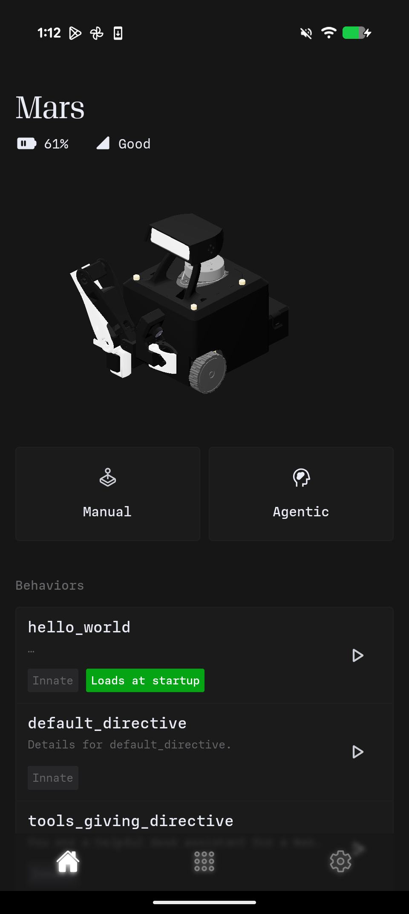

# Agents

An agent defines who your robot is and what it can do. Without an agent, a robot is just hardware waiting for instructions. With an agent, it becomes a security guard, a tour guide, a friendly greeter etc.

## What is an Agent?

An agent is a Python class that configures three things:

1. **Skills** — The actions the robot can perform
2. **Inputs** — The sensors and data streams the robot monitors
3. **Prompt** — The personality and behavioral guidelines

When you activate an agent, the robot adopts that identity. The same hardware can run completely different agents, each with distinct capabilities and personalities.

## Agents as Portable Applications

Agents are designed to be shareable. Write an agent once, and anyone with an Innate robot can use it—just drop the Python file into the agents folder.

No configuration files. No complex setup. Just Python.


{% column width="66.66666666666666%" valign="middle" %}
Every Innate robot ships with pre-installed agents that appear on the **Home** screen in the Innate Controller App.

**Built-in agents include:**

- **MARS** — The default agent with a friendly personality, can wave and interact with people
- **Basic** — A minimal agent for simple demonstrations
- **Demo** — Showcases various robot capabilities including gaze tracking

These serve as starting points. The real power comes from writing your own agents tailored to your specific use cases.


{% column width="33.33333333333334%" %}

<div data-with-frame="true"><figure><figcaption></figcaption></figure></div>



## System Architecture

Agents integrate into the following architecture:

```
┌─────────────────────────────────────────────────────────────────┐
│                        Cloud AI                                  │
│            Processes vision and makes decisions                  │
└────────────────────────────┬────────────────────────────────────┘
                             │ WebSocket
┌────────────────────────────▼────────────────────────────────────┐
│                    Brain Client (ROS 2)                          │
│       Manages agents, executes skills, bridges cloud ↔ robot     │
└────────────────────────────┬────────────────────────────────────┘
                             │
        ┌────────────────────┼────────────────────┐
        │                    │                    │
┌───────▼───────┐    ┌───────▼───────┐    ┌──────▼──────┐
│    Agents     │    │    Skills     │    │   Inputs    │
│ (Personality) │    │  (Actions)    │    │  (Sensors)  │
└───────────────┘    └───────────────┘    └─────────────┘
```

The cloud AI receives camera feeds and input data. It reads the agent's prompt to understand the robot's role, checks available skills to know what actions are possible, then decides what to do. The robot executes accordingly.

Your agent is the contract between you and the AI—it defines who the robot is and what it can do.

## Design Philosophy

Traditional robotics software often requires deep expertise to modify. Agents take a different approach: they're designed to be readable and modifiable.

You can look at an agent file and immediately understand what it does. You can modify it, experiment, and iterate quickly. The goal is to let you focus on building interesting robot behaviors rather than wrestling with infrastructure.
