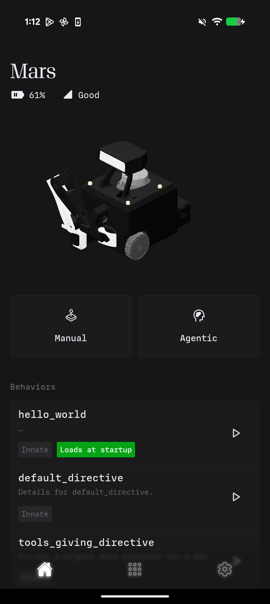

# Starting an Agent

Once you've created an agent, you can activate it through the Controller App or directly on the robot.

## Using the Controller App


{% column width="60%" valign="middle" %}
1. Open the **Innate Controller App** on your phone
2. Connect to your robot (it appears automatically on the same network)
3. Navigate to the **Home** screen
4. Locate your agent in the list
5. Tap to activate

The robot switches to the new agent immediately. To switch agents, tap a different one. To stop the current agent, use the stop button.


{% column width="40%" %}

<figure><figcaption></figcaption></figure>




## Setting a Default Agent

You can configure an agent to start automatically when the robot boots.

Use cases:
- Demonstrations requiring immediate readiness
- Permanent installations
- Unattended operation

To set a default agent:
1. Open the Controller App
2. Go to **Home**
3. Long-press on an agent
4. Select **Set as default**

The app displays an indicator on default agents. To remove the default, long-press and select **Remove default**.

## Activation Sequence

When you activate an agent, the system performs these steps:

1. **Skills load** — Required skills become available
2. **Inputs activate** — Microphone, sensors, and other inputs start
3. **Prompt uploads** — Personality instructions are sent to the cloud AI
4. **Gaze enables** — Person tracking starts (if configured)
5. **Processing begins** — The AI starts analyzing camera feeds and making decisions

This sequence completes in approximately one second.

## Switching Between Agents

Agent switching is instantaneous and clean:

1. Current agent's skills deactivate
2. Current inputs close
3. New agent's skills load
4. New inputs open
5. New prompt uploads

In-progress actions are cancelled immediately. The robot doesn't complete pending tasks from the previous agent—it transitions directly to the new identity.

## Troubleshooting

### Agent doesn't appear in the app

- Verify the file is in `~/agents` on the robot
- Check for Python syntax errors by importing the file manually
- Restart the brain service: `sudo systemctl restart innate-brain`

### Agent won't start

- Check robot logs for error messages
- Verify all skills referenced in `get_skills()` exist
- Confirm the prompt is not empty

### Agent starts but robot is unresponsive

- Make the prompt more specific—vague instructions produce inconsistent behavior
- Verify required skills are listed in `get_skills()`
- Confirm necessary inputs (like microphone) are in `get_inputs()`

## Next Steps

- [Skills](../skills/) — Create custom actions for your agents
- [Inputs](../inputs/) — Connect additional sensors
- [System Overview](../overview.md) — Understand the full architecture
